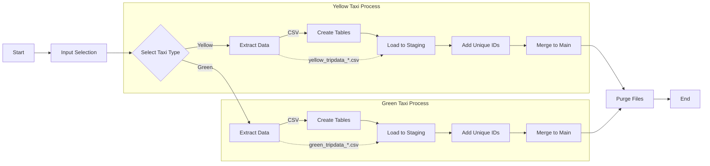

# NYC Taxi Data Pipeline with Kestra

This guide walks through setting up a data pipeline using Kestra to process NYC Taxi trip data.

## Prerequisites

- Docker and Docker Compose installed
- Basic understanding of SQL and YAML
- Git installed

## Project Setup

1. Clone the Data Engineering Zoomcamp repository:
```bash
git clone https://github.com/DataTalksClub/data-engineering-zoomcamp.git
```

2. Navigate to the workflow orchestration section and follow the [local setup instructions](https://github.com/DataTalksClub/data-engineering-zoomcamp/tree/main/02-workflow-orchestration#6-additional-resources)

## Project Structure

```
kestra-pipeline-proj/
├── flows/
│   ├── 02_postgres_taxi.yaml         # Main pipeline definition
│   ├── 02_postgres_taxi_scheduled.yaml    # Scheduled version of the pipeline
│   └── 03_postgres_dbt.yaml          # DBT transformation pipeline
└── README.md                    # This file
```

## Pipeline Overview

This pipeline demonstrates:
1. Data extraction from HTTP REST API
2. Data transformation using Python
3. Loading data into PostgreSQL
4. Data deduplication and merging

### Key Components

1. **Dynamic Inputs**
   - Taxi type (yellow/green)
   - Year (2019/2020)
   - Month (01-12)

2. **Main Tasks**
   - `set_label`: Store metadata
   - `extract`: Download and decompress data
   - `if_yellow_taxi`/`if_green_taxi`: Conditional processing
   - `purge_files`: Cleanup

3. **Database Operations**
   - Create tables
   - Load data
   - Add unique IDs
   - Merge data

## Pipeline Implementation

### 1. Dynamic Input Configuration
```yaml
inputs:
  - id: taxi
    type: SELECT
    displayName: Select taxi type
    values: [yellow, green]
    defaults: yellow
  
  - id: year
    type: SELECT
    displayName: Select year
    values: ["2019", "2020"]
    defaults: "2019"
  
  - id: month
    type: SELECT
    displayName: Select month
    values: ["01", "02", "03", "04", "05", "06", "07", "08", "09", "10", "11", "12"]
    defaults: "01"
```

### 2. Variable Definitions
```yaml
variables:
  file: "{{inputs.taxi}}_tripdata_{{inputs.year}}-{{inputs.month}}.csv"
  staging_table: "public.{{inputs.taxi}}_tripdata_staging"
  table: "public.{{inputs.taxi}}_tripdata"
  data: "{{outputs.extract.outputFiles[inputs.taxi ~ '_tripdata_' ~ inputs.year ~ '-' ~ inputs.month ~ '.csv']}}"
```

### 3. Data Extraction Task
```yaml
- id: extract
  type: io.kestra.plugin.scripts.shell.Commands
  outputFiles:
    - "*.csv"
  taskRunner:
    type: io.kestra.plugin.core.runner.Process
  commands:
    - wget -qO- https://github.com/DataTalksClub/nyc-tlc-data/releases/download/{{inputs.taxi}}/{{render(vars.file)}}.gz | gunzip > {{render(vars.file)}}
```

### 4. Data Processing Example (Green Taxi)
```yaml
# Create staging table
- id: green_create_staging_table
  type: io.kestra.plugin.jdbc.postgresql.Queries
  sql: |
    CREATE TABLE IF NOT EXISTS {{render(vars.staging_table)}} (
      unique_row_id          text,
      filename               text,
      VendorID              text,
      lpep_pickup_datetime  timestamp,
      # ... other columns ...
    );

# Add unique identifiers
- id: green_add_unique_id_and_filename
  type: io.kestra.plugin.jdbc.postgresql.Queries
  sql: |
    UPDATE {{render(vars.staging_table)}}
    SET 
      unique_row_id = md5(
        COALESCE(CAST(VendorID AS text), '') ||
        COALESCE(CAST(lpep_pickup_datetime AS text), '') || 
        # ... other fields for uniqueness ...
      ),
      filename = '{{render(vars.file)}}';
```

### 5. Data Merging Example
```sql
MERGE INTO {{render(vars.table)}} AS T
USING {{render(vars.staging_table)}} AS S
ON T.unique_row_id = S.unique_row_id
WHEN NOT MATCHED THEN
  INSERT (unique_row_id, filename, /* other columns */)
  VALUES (S.unique_row_id, S.filename, /* other values */);
```

## Pipeline Flow Diagram



## Running the Pipeline

1. Start Kestra and PostgreSQL:
```bash
docker-compose up -d
```

2. Access Kestra UI:
```
http://localhost:8080
```

3. Create new trigger with following parameters:
   - Namespace: `zc`
   - Flow: `02_postgres_taxi`
   - Select inputs as needed

## Database Configuration

PostgreSQL connection details (configured in YAML):
```yaml
url: jdbc:postgresql://host.docker.internal:5432/postgres-zc
username: kestra
password: k3str4
```

## Data Schema

### Yellow Taxi
```sql
-- Main columns
VendorID               text
tpep_pickup_datetime   timestamp
tpep_dropoff_datetime  timestamp
passenger_count        integer
trip_distance          double precision
-- ... other columns ...

-- Added columns for deduplication
unique_row_id          text    -- MD5 hash of key fields
filename               text    -- Source file tracking
```

### Green Taxi
```sql
-- Main columns
VendorID               text
lpep_pickup_datetime   timestamp
lpep_dropoff_datetime  timestamp
passenger_count        integer
trip_distance          double precision
-- ... other columns ...

-- Added columns for deduplication
unique_row_id          text    -- MD5 hash of key fields
filename               text    -- Source file tracking
```

## Understanding COALESCE Usage

In our pipeline, we use COALESCE for generating unique row IDs. Here's why:

```sql
unique_row_id = md5(
    COALESCE(CAST(VendorID AS text), '') ||
    COALESCE(CAST(pickup_datetime AS text), '') || 
    COALESCE(CAST(dropoff_datetime AS text), '') ||
    -- ...other fields
)
```

### Why COALESCE?

1. **NULL Handling**: COALESCE returns the first non-NULL value in a list
   - If VendorID is NULL → returns empty string ''
   - Prevents NULL values from breaking the concatenation

2. **Data Quality**:
   - Ensures consistent unique ID generation even with missing data
   - Empty string is better than NULL for concatenation

3. **Deduplication Logic**:
   - Creates consistent hashes for same trips
   - Handles both clean and messy data reliably

Example:
```sql
-- Without COALESCE
'123' || NULL || '456'  → NULL

-- With COALESCE
'123' || COALESCE(NULL, '') || '456'  → '123456'
```

## Useful Links

- [NYC TLC Trip Data](https://github.com/DataTalksClub/nyc-tlc-data/releases)
- [Kestra Documentation](https://kestra.io/docs)
- [PostgreSQL Documentation](https://www.postgresql.org/docs/)

## Notes

- The pipeline uses staging tables to prevent data corruption
- Deduplication is handled via MD5 hashes of key fields
- Data is merged using PostgreSQL's MERGE statement

## Scheduled Pipeline Implementation

The scheduled version (`02_postgres_taxi_scheduled.yaml`) automates the data ingestion process with the following modifications:

### Key Changes from Base Pipeline

1. **Simplified Input Parameters**
   - Removed manual year/month selections
   - Only taxi type remains as input parameter
   - Date parameters derived from trigger timing

2. **Dynamic Date Variables**
   ```yaml
   variables:
     file: "{{inputs.taxi}}_tripdata_{{trigger.date | date('yyyy-MM')}}.csv"
   ```

3. **Concurrency Control**
   ```yaml
   concurrency:
     limit: 1  # Prevents parallel execution issues
   ```

4. **Automated Scheduling**
   ```yaml
   triggers:
     - id: green_schedule
       type: io.kestra.plugin.core.trigger.Schedule
       cron: "0 9 1 * *"  # 9 AM, 1st of each month
       inputs:
         taxi: green

     - id: yellow_schedule
       type: io.kestra.plugin.core.trigger.Schedule
       cron: "0 10 1 * *"  # 10 AM, 1st of each month
       inputs:
         taxi: yellow
   ```

### Scheduled Flow Diagram

```mermaid
%%{init: {
    'theme': 'dark',
    'themeVariables': {
        'primaryColor': '#2d3436',
        'primaryTextColor': '#fff',
        'primaryBorderColor': '#fff',
        'lineColor': '#fff',
        'secondaryColor': '#384f5f',
        'tertiaryColor': '#2f3640'
    }
}}%%
graph LR
    T1(["Monthly Triggers"])
    T1 -->|"Green (9 AM)"| L["Set Labels"]
    T1 -->|"Yellow (10 AM)"| L
    L --> E["Extract Data"]
    E --> C{"Taxi Type?"}
    
    C -->|"Green"| G["Green Flow"]
    G --> GT["Create Tables"] --> GS["Load Staging"] --> GU["Add Unique IDs"] --> GM["Merge Data"]
    
    C -->|"Yellow"| Y["Yellow Flow"]
    Y --> YT["Create Tables"] --> YS["Load Staging"] --> YU["Add Unique IDs"] --> YM["Merge Data"]
    
    GM --> P["Purge Files"]
    YM --> P
    
    GM --> DB[("PostgreSQL")]
    YM --> DB

    classDef trigger fill:#00b894,stroke:#fff,stroke-width:2px;
    classDef process fill:#0984e3,stroke:#fff,stroke-width:2px;
    classDef database fill:#6c5ce7,stroke:#fff,stroke-width:2px;
    classDef condition fill:#00cec9,stroke:#fff,stroke-width:2px;
    
    class T1 trigger;
    class L,E,G,Y,GT,GS,GU,GM,YT,YS,YU,YM,P process;
    class DB database;
    class C condition;
```



### Backfilling Data

To process historical data:

1. From Kestra UI:
   - Navigate to scheduled flow
   - Click "Execute"
   - Add label `backfill:true`
   - Set appropriate trigger date
   - Execute flow

2. Monitor backfill progress:
   - Check execution status
   - Verify data in PostgreSQL
   - Confirm proper deduplication

### Schedule Management

1. **Execution Order**
   - Green taxi data: 9 AM on 1st of month
   - Yellow taxi data: 10 AM on 1st of month
   - One hour gap prevents resource contention

2. **Concurrency Control**
   - Single execution at a time
   - Prevents data conflicts
   - Queues concurrent triggers

## DBT Flow Implementation

The `03_postgres_dbt.yaml` flow orchestrates dbt models for transforming the taxi data.

### Flow Structure

```mermaid
graph TD
    A[Start] --> B[Input Selection]
    B --> C[Git Sync]
    C --> D[DBT Build]
    D --> E[Store Manifest]
    E --> F[End]

    style A fill:#2d3436,stroke:#fff,stroke-width:2px
    style F fill:#2d3436,stroke:#fff,stroke-width:2px
    style C fill:#00b894,stroke:#fff,stroke-width:2px
    style D fill:#0984e3,stroke:#fff,stroke-width:2px
```



### Key Components

1. **Input Selection**
   - `dbt build`: Regular model building
   - `dbt debug`: Initial connection testing
   ```yaml
   inputs:
     - id: dbt_command
       type: SELECT
       allowCustomValue: true
       defaults: dbt build
   ```

2. **Git Sync Task**
   - Pulls dbt models from data-engineering-zoomcamp repository
   - Syncs to Namespace Files
   - Can be disabled after initial setup

3. **DBT Configuration**
   - Uses `dbt-postgres` container image
   - Configures database connection via profiles
   - Stores model manifest for lineage tracking

### Running the DBT Flow

1. **First Time Setup**
   ```bash
   # Run with dbt debug first
   Command: dbt debug
   ```

2. **Regular Model Building**
   ```bash
   # Build all models
   Command: dbt build
   ```

3. **Database Configuration**
   ```yaml
   # Connection details
   host: host.docker.internal
   port: 5432
   dbname: postgres-zc
   schema: public
   ```

### Model Dependencies

```mermaid
graph LR
    A[Raw Data] --> B[Staging Models]
    B --> C[Core Models]
    
    subgraph "Source Tables"
        A1[yellow_tripdata]
        A2[green_tripdata]
    end
    
    subgraph "Staging Layer"
        B1[stg_yellow_trips]
        B2[stg_green_trips]
    end
    
    subgraph "Core Layer"
        C1[fact_trips]
        C2[dim_zones]
    end
    
    A1 --> B1
    A2 --> B2
    B1 --> C1
    B2 --> C1
    
    style A1 fill:#2d3436
    style A2 fill:#2d3436
    style B1 fill:#00b894
    style B2 fill:#00b894
    style C1 fill:#0984e3
    style C2 fill:#0984e3
```



### Troubleshooting

1. **Connection Issues**
   - Verify database settings in profiles.yml
   - Ensure PostgreSQL container is running
   - Check host.docker.internal resolution

2. **Model Failures**
   - Review dbt logs in task output
   - Verify source table existence
   - Check schema configurations

3. **Git Sync Problems**
   - Confirm repository accessibility
   - Verify branch name
   - Check gitDirectory path

### Best Practices

1. **Development Workflow**
   - Test with `dbt debug` first
   - Review model SQL before building
   - Monitor task execution logs

2. **Production Setup**
   - Disable Git sync after initial setup
   - Use manifest storage for lineage
   - Schedule after data ingestion completes

3. **Maintenance**
   - Regular manifest updates
   - Monitor model performance
   - Review transformation logic


